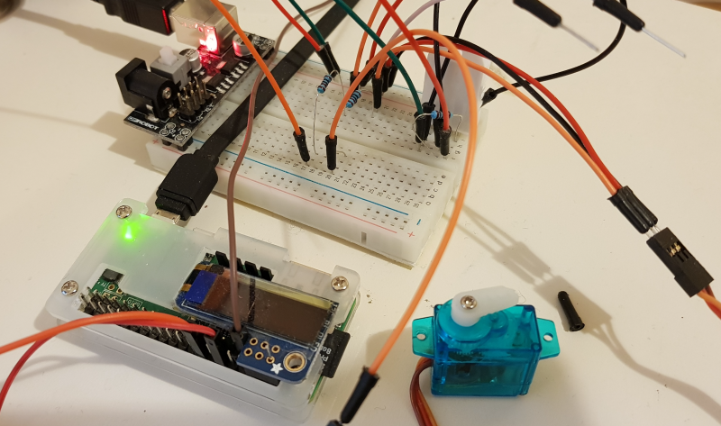

go-servotester is a simple RC servo tester program on Raspberry Pi using the Go programming language (http://golang.org/).

It uses the following projects:
- gobot (http://gobot.io/) for managing pin on Raspberry Pi platform

Use [my fork](https://github.com/starryalley/gobot) where I added a support to configure pi-blaster period on a raspi.Adaptor. 

- pi-blaster (https://github.com/sarfata/pi-blaster) for generating PWM in raspberry Pi

Use [my fork](https://github.com/starryalley/pi-blaster) where I modify the period to make the PWM frequency at 50Hz, which is for both analog and digital RC servo.

- libui (https://github.com/andlabs/ui) for GUI


# Getting started

I run my raspi headlessly so I make this a simple client-server program. The server runs on raspi and listens on a port receving command to control the RC servo. The client program comes with a GUI or a CLI interface, sending servo position command to the server, and raspi will then set the PWM on specific pin to control the RC servo.



# Build and Install

Default build is for ARM6

`make`


For ARM7, use:

`make build_arm7 build_client`

Note: Raspberry Pi A, A+, B, B+, Zero use ARM6, and Raspberry Pi 2, 3 use ARM7.

Copy the `pi-servotesterd` binary to Raspberry. `servotester` and `servotester_cli` are client program with user interface.


# Usage

Servo running on raspi, using pi-blaster period 20000000ns, listening on port 6789:

`./pi-servotesterd -period 20000000 -port 6789`

For GUI control, run this on your desktop

`./servotester`


For cli control, run this on your desktop with correct raspi IP and port

`./servotester_cli -addr 192.168.0.123 -port 6789`

You will see:

```
Connecting to 192.168.0.123:6789
Servo Position>
```

Command format:

`exit`: to exit the program

`12=0`: set pin 12 servo position to 0% (0-100% based on 1ms~2ms endpoints)

`12=23.4`: set pin 12 servo position to 23.4%

`12=swing`: do a full range swing on pin 12

`12=center`: center the servo on pin 12

